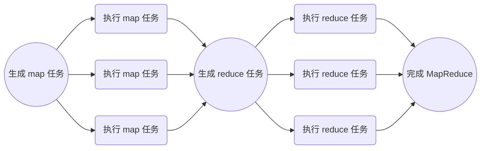

考完研想给自己的简历镀金（灌水？），于是想做一下大名鼎鼎的 MIT 6.5840(or 6.824) 。理论知识和框架都在⚡🧱的课程中学习和使用过，所以对于 lectures 就快速浏览了[翻译版本](https://mit-public-courses-cn-translatio.gitbook.io/mit6-824/)，直接进入 projects 阶段：

<!--more-->

# 阅读论文

[MapReduce 论文](http://research.google.com/archive/mapreduce-osdi04.pdf)中给出了在一个由大量消费级 PC 和网络组成的集群上实现 MapReduce 的思路。然而 lab 1 中要求的环境是在单机上，使用进程模拟的分布式环境，所以完全照搬论文思路似乎并不合理。~（另，lab 1 中将论文的 master 称为 coordinator 是否有点太过政治正确了……）~

## 分析执行过程

> We have given you a little code to start you off. The "main" routines for the coordinator and worker are in `main/mrcoordinator.go` and `main/mrworker.go`; don't change these files. You should put your implementation in `mr/coordinator.go`,` mr/worker.go`, and `mr/rpc.go`. 

lab 中给出了基本的执行框架，与论文中的略有区别。正如论文中提到的，

> Many different implementations of the MapReduce interface are possible. The right choice depends on the environment. 

lab的运行环境与论文中并不相同。需要实现的内容集中在 `mr/coordinator.go` ` mr/worker.go` `mr/rpc.go`三个文件中。


### Action 1 准备工作

> The MapReduce library in the user program first splits the input files into M pieces of typically 16 megabytes to 64 megabytes (MB) per piece (controllable by the user via an optional parameter). It then starts up many copies of the program on a cluster of machines.

论文中的第一步，由用户程序调用MapReduce库，将输入文件分割为M个16-64MB 的块（对应后续产生的M个map任务），然后在集群中fork出多份程序的副本，其中一个为Master，其余为Worker。

而lab中，用户程序对应了`main/mrcoordinator.go`（创建coordinator进程）`main/mrworker.go`（创建worker进程）`test-mr.sh`（执行脚本）`mrapps/*.go`（定义map/reduce函数，以[Go plugin](https://pkg.go.dev/plugin)的形式加载至worker）。这一部分均为给定的代码，不需要自己实现。对于文件分割，lab中给出的方案是直接按照文件执行map任务，不需要分割。

### Action 2 角色划分

> One of the copies of the program is special – the master. The rest are workers that are assigned work by the master. There are M map tasks and R reduce tasks to assign. The master picks idle workers and assigns each one a map task or a reduce task.

论文中，由master指定空闲的worker来执行任务。而lab中，由worker（通过RPC）向coordinator请求任务并执行。

### Action 3 - 4 map任务阶段

> A worker who is assigned a map task reads the contents of the corresponding input split. It parses key/value pairs out of the input data and passes each
> pair to the user-defined Map function. The intermediate key/value pairs produced by the Map function are buffered in memory. 

> Periodically, the buffered pairs are written to local disk, partitioned into R regions by the partitioning function. The locations of these buffered pairs on
> the local disk are passed back to the master, who is responsible for forwarding these locations to the reduce workers.

这一步中map worker读入输入文件，执行map函数，并给出中间数据。

论文中，输入输出数据保存在` a global file system`，或者在这个环境下应当特指GFS。类似地，hadoop将MapReduce的输入输出数据存放在HDFS中。

而map worker产生的中间数据存放在map worker的内存，再定期地将其分为R份（对应reduce任务数量）保存在本地硬盘。然后将中间数据的位置返回至master，并进一步由master通知reduce worker应该从哪里获取数据。

对于lab，这部分正是需要实现的。考虑lab的单机环境及较小的数据规模，比起实际的集群应当更容易实现。

### Action 5 - 6 reduce任务阶段

> When a reduce worker is notified by the master about these locations, it uses remote procedure calls to read the buffered data from the local disks of the map workers. When a reduce worker has read all intermediate data, it sorts it by the intermediate keys so that all occurrences of the same key are grouped together. The sorting is needed because typically many different keys map to the same reduce task. If the amount of intermediate data is too large to fit in memory, an external sort is used. 

> The reduce worker iterates over the sorted intermediate data and for each unique intermediate key encountered, it passes the key and the corresponding
> set of intermediate values to the user’s Reduce function. The output of the Reduce function is appended to a final output file for this reduce partition.

这一步中，reduce worker读取中间数据，执行reduce函数，并得出最终的输出文件。同样的，这一部分是需要实现的。

值得注意的是，论文提到了超出内存范围时，需要使用外部排序，但是给出的样例程序`main/mrsequential.go`并没有实现超出内存范围的处理方式，完全运行于内存中。 故应当不用考虑超出内存范围的数据（正如上文，lab的数据规模还是比较友好的）。

### Action 7

> When all map tasks and reduce tasks have been completed, the master wakes up the user program. At this point, the MapReduce call in the user program returns back to the user code.

论文中，执行完MapReduce调用后，再次返回用户程序；而lab中不存在用户程序。

## 容错

论文中提到了三类容错：

### worker故障

论文中，master通过定期ping来确认worker存活状态。如果超时未响应则视为worker失效。

| 任务进度\失效类型 | map worker 失效 | reduce worker 失效 |
| :--: | :--: | :--: |
| 已完成 | 对应任务重新执行 | 无需重新执行 |
| 处理中 | 对应任务重新执行 | 对应任务重新执行 |

正如上文提到的，map/reduce worker产生的数据存放于不同位置。所以对于已完成的任务，如果是map任务，需要重新执行（因为产生的数据存储在worker本地磁盘）；而对于reduce人物，则无需重新执行（其数据存储以分布式多副本的形式存储于集群中。

对于lab，取决于实现方式，需要以不同方式处理worker故障：如果与论文一样，中间数据存于硬盘，则**不**需要重新执行已完成的map任务（显然，在单机环境下不用担心worker失效后丢失中间文件）；如果中间数据存于内存，则需要重新执行。

同时，lab中对于判断worker失效有着不同的方式。

> The coordinator should notice if a worker hasn't completed its task in a reasonable amount of time (for this lab, use ten seconds), and give the same task to a different worker.

不同于论文的ping，lab使用完成时间判断worker状态（具体判断方法有待实现）（显然不能是ping）。

### master 故障

论文中提到，可以通过定期保存master状态的checkpoint来重建失效的master，但是对于只有一台的master应当不容易失效，所以论文不考虑master的容错。

而lab整体都是运行于单机的，事实上不需要考虑容错（上文中的worker故障为题目要求的判断方式）。

### Semantics in the Presence of Failures

即对于具有确定性的Map和Reduce操作，MapReduce执行的结果应当与顺序执行的结果相同；而对于不具确定性的操作，MapReduce应当**等价于**（但不一定相同）顺序执行（考虑生成随机数的操作，显然语义上相同的执行并不一定得到相同结果）。这是由MapReduce的执行过程决定的。

# 实现过程

## 数据类型定义

 首先应当明确，要实现一个MapReduce框架，需要维护/传递哪些数据：

### 任务信息

```go
type MrTask struct {
	Id             int
	CreateTime     int64
	NReduce        int
	Type           TaskType
	Status         MrTaskStatus
	InputFileName  string
	InterFileNames []string
	OutputFileName string
}

type TaskType int

const (
	Map TaskType = iota
	Reduce
	NoMoreTasks
)

type MrTaskStatus int

const (
	Idle MrTaskStatus = iota
	InProgress
	Completed
)
```

与工作在GFS / HDFS上的MapReduce类似，我们的实现也是在同一个文件系统（本地文件系统）上的。任务信息通过RPC传递，而任务数据则通过文件传输。

三个FileName(s)字段中，Map任务需要读取`InputFileName`，输出`InterFileNames`；Reduce任务读取`InterFileNames`，输出`OutputFileName`。

另外，引入`CreateTime`是为了确认唯一的任务（或者说任务的一次执行）。因为任务在超时（lab中要求的10秒）后才会重新指定worker执行，所以`Id`和`CreateTime`一定可以确认唯一的一次任务执行。

### Coordinator

```go
type Coordinator struct {
	inputFileNames []string
	nReduce        int              // number of reduce tasks
	workerTimeOut  time.Duration    // time to re-assign tasks, default 10s
	state          coordinatorState // coordinator state
	tasks          [][]MrTask       // mapreduce tasks, example: task[Map][taskId]
	taskCount      int              // the number of tasks which are not completed
	taskLock       sync.Mutex       // lock for update Task Status
	taskChannel    chan MrTask      // channel to assign Idle tasks
}

type coordinatorState int

const (
	creating coordinatorState = iota
	mapping
	reducing
	done
)
```

与论文中提到的类似，master(coordinator)维护了关于整个MapReduce程序和每个任务的信息。taskChannel本身由于go channel的特性，可以保证互斥，而其他任务信息则需要互斥锁taskLock实现互斥访问。

### RPC数据

``` go
type GetTaskArgs struct {
	Nothing int
}
type GetTaskReply struct {
	Task MrTask
}

type ReportTaskArgs struct {
	Task MrTask
}
type ReportTaskReply struct {
	Nothing int
}
```

RPC只涉及两种情况：

- Worker向Coordinator请求任务
- Worker向Coordinator汇报任务

二者均只需要传递一条任务信息，且无论任务成败均与Worker无关，而是由Coordinator来决定。所以这里使用`Nothing`占位，而不需要真的有参数/请求。

## Worker设计

正如其名，worker只需要work。它所需要做的就是请求任务->执行任务->汇报任务，不断循环。

```go
// main/mrworker.go calls this function.
func Worker(mapFunc func(string, string) []KeyValue,
	reduceFunc func(string, []string) string) {
	for {
		task := getTaskCall()
		if task.Type == Map {
			// read from input file
			file, err := os.Open(task.InputFileName)
			if err != nil {
				log.Fatalf("cannot open input file %v", task.InputFileName)
			}
			content, err := io.ReadAll(file)
			if err != nil {
				log.Fatalf("cannot read %v", task.InputFileName)
			}
			err = file.Close()
			if err != nil {
				log.Fatalf("cannot close %v: %v", task.InputFileName, err)
			}

			// run map function
			keyValues := mapFunc(task.InputFileName, string(content))

			// split intermediate data into R(or NReduce) pieces
			interDatas := make([][]KeyValue, 0)
			for i := 0; i < task.NReduce; i++ {
				interDatas = append(interDatas, make([]KeyValue, 0))
			}
			for _, kv := range keyValues {
				index := ihash(kv.Key) % task.NReduce
				interDatas[index] = append(interDatas[index], kv)
			}

			// serialize and write intermediate file
			for i := 0; i < task.NReduce; i++ {
				var buffer bytes.Buffer
				enc := gob.NewEncoder(&buffer)
				err := enc.Encode(interDatas[i])
				if err != nil {
					log.Fatal("encode error:", err)
				}
				interFileName := fmt.Sprintf("mr-map-%v-reduce-%v-%v", task.Id, i, task.CreateTime)
				file, err := os.Create(interFileName)
				if err != nil {
					log.Fatalf("cannot create %v", interFileName)
				}
				_, err = file.Write(buffer.Bytes())
				if err != nil {
					log.Fatalf("cannot write %v", interFileName)
				}
				err = file.Close()
				if err != nil {
					log.Fatalf("cannot close %v", interFileName)
				}
				task.InterFileNames = append(task.InterFileNames, interFileName)
			}
			task.Status = Completed

		} else if task.Type == Reduce {
			// read and deserialize intermedia data
			var interData []KeyValue
			interNum := len(task.InterFileNames)
			for i := 0; i < interNum; i++ {
				var buffer bytes.Buffer
				dec := gob.NewDecoder(&buffer)
				interFileName := task.InterFileNames[i]
				file, err := os.Open(interFileName)
				if err != nil {
					log.Fatalf("cannot open intermediate file %v", interFileName)
				}
				content, err := io.ReadAll(file)
				if err != nil {
					log.Fatalf("cannot read %v", interFileName)
				}
				err = file.Close()
				if err != nil {
					log.Fatalf("cannot close %v", interFileName)
				}
				buffer.Write(content)
				var data []KeyValue
				err = dec.Decode(&data)
				if err != nil {
					log.Fatal("decode error:", err)
				}
				interData = append(interData, data...)
			}
			// prepare (Key, list(Value)) for reduce function
			kvMap := make(map[string][]string)
			for _, kv := range interData {
				elem, ok := kvMap[kv.Key]
				if ok {
					kvMap[kv.Key] = append(elem, kv.Value)
				} else {
					kvMap[kv.Key] = []string{kv.Value}
				}
			}

			// run reduce function
			outputString := ""
			for key, values := range kvMap {
				outputString += fmt.Sprintf("%v %v\n", key, reduceFunc(key, values))
			}

			// write output file
			outputFileName := fmt.Sprintf("mr-out-%v-%v", task.Id, task.CreateTime)
			file, err := os.Create(outputFileName)
			if err != nil {
				log.Fatalf("cannot create %v", outputFileName)
			}
			_, err = file.WriteString(outputString)
			if err != nil {
				log.Fatalf("cannot write %v", outputFileName)
			}
			err = file.Close()
			if err != nil {
				log.Fatalf("cannot close %v", outputFileName)
			}
			task.OutputFileName = outputFileName
			task.Status = Completed

		} else if task.Type == NoMoreTasks {
			os.Exit(0)
		}

		// report Task
		ReportTaskCall(task)
	}
}
```

值得注意的是中间文件/输出文件的命名：二者均追加了时间戳，用于避免冲突。而最终是否将中间文件用于生成reduce任务/将输出文件确认为最终结果（删去文件名的时间戳），都交由coordinator决定。

## Coordinator设计

相较于逻辑非常简单的Worker，Coordinator的任务较为复杂。需要生成任务、分配任务、判断任务是否正常完成等。其中除了生成任务的部分以外均需要并发。




### 创建Coordinator

```go
// create a Coordinator.
// main/mrcoordinator.go calls this function.
// NReduce is the number of reduce tasks to use.
func MakeCoordinator(files []string, nReduce int) *Coordinator {
	c := Coordinator{
		inputFileNames: files,
		nReduce:        nReduce,
		workerTimeOut:  time.Second * 10,
		state:          creating,
		tasks:          [][]MrTask{make([]MrTask, 0), make([]MrTask, 0)},
		taskLock:       sync.Mutex{},
		taskChannel:    make(chan MrTask, max_(len(files), nReduce)+1),
	}
	c.taskLock.Lock()
	c.generateMapTasks()
	c.taskLock.Unlock()
	c.server()
	return &c
}
```

创建coordinator，生成map任务，运行RPC服务端。

### 生成 map 任务

``` go
func (c *Coordinator) generateMapTasks() {
	taskNumber := len(c.inputFileNames)
	for i := 0; i < taskNumber; i++ {
		task := MrTask{
			Id:             i,
			CreateTime:     time.Now().Unix(),
			NReduce:        c.nReduce,
			Type:           Map,
			Status:         Idle,
			InputFileName:  c.inputFileNames[i],
			InterFileNames: make([]string, 0),
		}
		c.tasks[Map] = append(c.tasks[Map], task)
	}
	c.taskCount = taskNumber
	c.state = mapping
	for _, task := range c.tasks[Map] {
		c.taskChannel <- task
	}
}
```

### 生成 reduce 任务

``` go
func (c *Coordinator) generateReduceTasks() {
	mapTaskNumber := len(c.inputFileNames)
	reduceTaskNumber := c.nReduce

	for i := 0; i < reduceTaskNumber; i++ {
		task := MrTask{
			Id:             i,
			CreateTime:     time.Now().Unix(),
			NReduce:        c.nReduce,
			Type:           Reduce,
			Status:         Idle,
			InterFileNames: make([]string, 0),
		}
		c.tasks[Reduce] = append(c.tasks[Reduce], task)
	}

	// shuffle intermediate files
	for mapIndex := 0; mapIndex < mapTaskNumber; mapIndex++ {
		for reduceIndex := 0; reduceIndex < reduceTaskNumber; reduceIndex++ {
			c.tasks[Reduce][reduceIndex].InterFileNames =
				append(c.tasks[Reduce][reduceIndex].InterFileNames,
					c.tasks[Map][mapIndex].InterFileNames[reduceIndex])
		}
	}

	c.taskCount = reduceTaskNumber
	c.state = reducing
	for _, task := range c.tasks[Reduce] {
		c.taskChannel <- task
	}
}
```

### 得出输出文件 & 删除中间文件

```go
// CleanUp - remove intermedia files & rename output files
func (c *Coordinator) CleanUp() {
	for _, task := range c.tasks[Reduce] {
		deleteFiles(task.InterFileNames)
		renameFile(task.OutputFileName, fmt.Sprintf("mr-out-%v", task.Id))
	}
}
```


### 处理 worker请求

如上文，worker会在两种情况下使用RPC向coordinator发送请求：

- 获取任务

    ```go
    func (c *Coordinator) GetTask(args *GetTaskArgs, reply *GetTaskReply) error {
    	_ = args
    	task := <-c.taskChannel
    	if task.Type != NoMoreTasks {
    		c.taskLock.Lock()
    		defer c.taskLock.Unlock()
    		c.tasks[task.Type][task.Id].Status = InProgress
    		go c.taskTimeOut(&c.tasks[task.Type][task.Id])
    	}
    	reply.Task = task
    	return nil
    }
    
    func (c *Coordinator) taskTimeOut(task *MrTask) {
        time.Sleep(c.workerTimeOut)
        c.taskLock.Lock()
        defer c.taskLock.Unlock()
        if task.Status != Completed {
            // worker time out, create a new task
            task.Status = Idle
            task.CreateTime = time.Now().Unix()
            c.taskChannel <- *task
        }
    }
    ```
    
    当worker获取任务时，coordinator的任务列表中，会将这次任务标记为`InProgress`。同时，创建一个 go routine 用于计时。如果10秒后，这次任务还没有完成，则视为失败。这时会使用一个新的时间戳来创建新的任务，并放入等待执行的channel中。
    
- 汇报任务

    ```go
    func (c *Coordinator) ReportTask(args *ReportTaskArgs, reply *ReportTaskReply) error {
    	_ = reply
    	taskId := args.Task.Id
    	taskType := args.Task.Type
    	c.taskLock.Lock()
    	defer c.taskLock.Unlock()
    	if c.tasks[taskType][taskId].CreateTime == args.Task.CreateTime {
    		// completed in time, take as valid report
    		c.tasks[taskType][taskId] = args.Task
    		c.taskCount--
    		if c.taskCount == 0 {
    			if c.state == mapping {
    				c.generateReduceTasks()
    				c.state = reducing
    			} else if c.state == reducing {
    				c.CleanUp()
    				c.state = done
    			}
    		}
    	} else {
    		// time out, invalid report
    		if args.Task.Type == Map {
    			deleteFiles(args.Task.InterFileNames)
    		} else {
    			deleteFiles([]string{args.Task.OutputFileName})
    		}
    	}
    	return nil
    }
    ```

    如果汇报的任务与coordinator中的时间戳不符，则表明这次汇报的任务已经因为超时，被再次分配了。

    如果时间戳相符，则证明是一次成功的任务执行。这时coordinator使用汇报的任务信息替换自身保存的任务信息。

    当所有任务都被成功执行后（`taskCount`减为0），则coordinator会转入下一个工作阶段：从mapping到reducing，或者从reducing到done。

# 测试结果

```bash
$ bash test-mr.sh
*** Starting wc test.
--- wc test: PASS
*** Starting indexer test.
--- indexer test: PASS
*** Starting map parallelism test.
--- map parallelism test: PASS
*** Starting reduce parallelism test.
--- reduce parallelism test: PASS
*** Starting job count test.
unexpected EOF
unexpected EOF
2024/02/20 21:04:09 Get Task failed!
2024/02/20 21:04:09 Get Task failed!
--- job count test: PASS
*** Starting early exit test.
--- early exit test: PASS
*** Starting crash test.
unexpected EOF
unexpected EOF
unexpected EOF
2024/02/20 21:04:37 Get Task failed!
2024/02/20 21:04:37 Get Task failed!
2024/02/20 21:04:37 Get Task failed!
--- crash test: PASS
*** PASSED ALL TESTS
```

## 异常分析

到这里已经完成了所有的test，但是其中出现的一些异常有些碍眼。

unexpected EOF 和 Get Task failed! 仅成对出现于coordinator早于worker结束的情况：coordinator已经完成MapReduce任务，关闭RPC服务端；而worker仍然通过RPC客户端尝试获取任务，导致异常退出（log.Fatal(xxx)）。

事实上这些异常均发生在MapReduce任务结束后，并不会影响测试结果，但是对于代码的精神洁癖促使我尝试解决这些异常：

### job count test

其中，job count test出现这一问题是因为`test-mr.sh`中少了一个`&`

```bash
maybe_quiet $TIMEOUT ../mrworker ../../mrapps/jobcount.so &
maybe_quiet $TIMEOUT ../mrworker ../../mrapps/jobcount.so
maybe_quiet $TIMEOUT ../mrworker ../../mrapps/jobcount.so &
maybe_quiet $TIMEOUT ../mrworker ../../mrapps/jobcount.so
```

由于第二个worker不是使用subshell后台运行，导致前两个worker结束后才会启动后两个worker。而前两个worker与coordinator几乎同时结束（worker在执行完最后一个任务后，收到`NoMoreTasks`结束；coordinator在`src/main/mrcoordinator.go`发现任务结束后被结束）。

```go
func main() {
	if len(os.Args) < 2 {
		fmt.Fprintf(os.Stderr, "Usage: mrcoordinator inputfiles...\n")
		os.Exit(1)
	}

	m := mr.MakeCoordinator(os.Args[1:], 10)
	for m.Done() == false {
		time.Sleep(time.Second)
	}

	time.Sleep(time.Second)
}
```

所以后两个worker获取任务失败。

解决方案：在第二个mrworker后添加`&`

### crash test

crash test 中的异常成因类似，但并不完全是测试脚本的问题：

```bash
rm -f mr-done
((maybe_quiet $TIMEOUT2 ../mrcoordinator ../pg*txt); touch mr-done ) &
sleep 1

# start multiple workers
maybe_quiet $TIMEOUT2 ../mrworker ../../mrapps/crash.so &

# mimic rpc.go's coordinatorSock()
SOCKNAME=/var/tmp/5840-mr-`id -u`

( while [ -e $SOCKNAME -a ! -f mr-done ]
  do
    maybe_quiet $TIMEOUT2 ../mrworker ../../mrapps/crash.so
    sleep 1
  done ) &

( while [ -e $SOCKNAME -a ! -f mr-done ]
  do
    maybe_quiet $TIMEOUT2 ../mrworker ../../mrapps/crash.so
    sleep 1
  done ) &

while [ -e $SOCKNAME -a ! -f mr-done ]
do
  maybe_quiet $TIMEOUT2 ../mrworker ../../mrapps/crash.so
  sleep 1
done

```

在这个test中，使用三个while来启动worker：当worker结束**一秒**后，只要coordinator没有结束，就再次启动worker。

但是`src/main/mrcoordinator.go`中，调用`m.Done()`后sleep一秒，当返回值为true时再sleep一秒：忽略执行时间，当`coordinator.State`被设为`done`后的**1-2秒**，coordinator被结束。

而coordinator的实现中，只结束了运行完最后一个任务时被阻塞的worker，并没有考虑到这之后的worker。

```go
c.CleanUp()
c.state = done

// send NoMoreTasks to pending workers
for fin := false; !fin; {
    select {
    case <-c.taskChannel:
        fin = true
    default:
        c.taskChannel <- MrTask{Type: NoMoreTasks}
    }
}
// send to the worker that reported the last task
c.taskChannel <- MrTask{Type: NoMoreTasks}
```


这里我的实现思路与测试代码暗含的出题人的思路不同，我个人认为两种思路应当都是正确的：我的思路倾向于在worker正常结束后不会产生新的worker；而出题人似乎认为worker不会主动结束，只要结束就应当是crash。

解决方案有两种：

1. 将测试脚本中的`sleep 1`改为`sleep 2`
2. 使coordinator持续向`taskChannel`输入`MrTask{Type: NoMoreTasks}`，以结束后续所有的worker。（上一个问题也可以被这一方案解决，但是test的逻辑确实有问题，所以仍然应当按照上文修改测试代码）
    ```go
    c.CleanUp()
    
    // send NoMoreTasks to workers
    go func() {
        for {
            c.taskChannel <- MrTask{Type: NoMoreTasks}
        }
    }()
    
    c.state = done
    ```

修改后测试结果完全正常（启用了go的race detector）：

```bash
$ bash test-mr.sh
*** Starting wc test.
--- wc test: PASS
*** Starting indexer test.
--- indexer test: PASS
*** Starting map parallelism test.
--- map parallelism test: PASS
*** Starting reduce parallelism test.
--- reduce parallelism test: PASS
*** Starting job count test.
--- job count test: PASS
*** Starting early exit test.
--- early exit test: PASS
*** Starting crash test.
--- crash test: PASS
*** PASSED ALL TESTS
```

